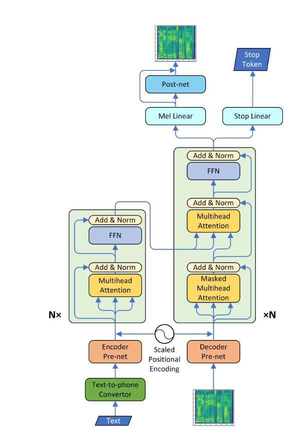
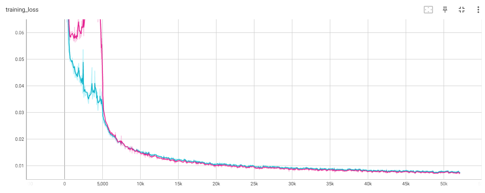
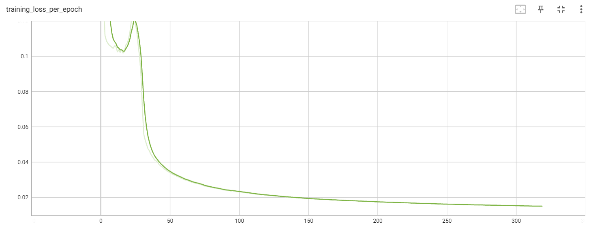
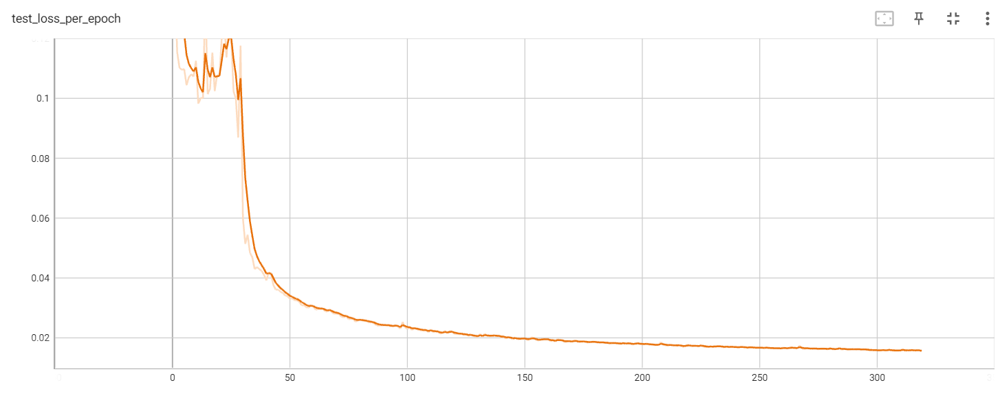
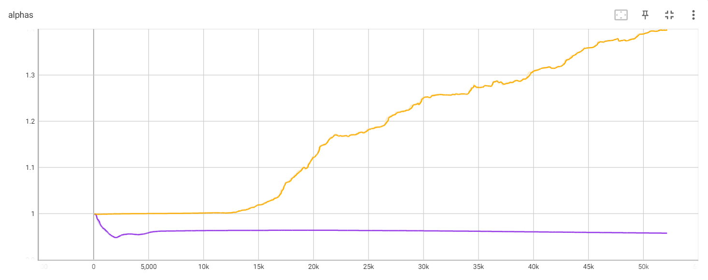

# **Text-to-Speech ▶• ılıılıılıılıılıılı**
<h2>🎯Aim</h2>
To develop a robust end-to-end Transformer-based Text-to-Speech (TTS) model that efficiently converts textual input into natural, high-quality speech output. The model aims to leverage the self-attention mechanism to capture long-range dependencies in text sequences, enabling more accurate prosody, intonation, and contextual understanding compared to traditional models. The goal is to create a system that can generalize well across various languages and speaking styles, ensuring smooth, realistic voice synthesis with minimal preprocessing and training time.

<h2>📘Details</h2>
<ul>
  <li>A Pytorch Implementation of end-to-end Speech Synthesis using Transformer Network.</li>
  <li>This model can be trained almost 3 to 4 times faster than most of the autoregressive models, since Transformers lie under one of the fastest computing autoregressive models. The quality of the speech was retrieved too.</li>
  <li>I learned the post network using CBHG(Convolutional Bank + Highway network + GRU) model of tacotron and converted the spectrogram into raw wave using griffin-lim algorithm, and in future I want to use pre-trained hifi-gan vocoder for generating raw audio.</li>
</ul>

<h2>🦾Transformer Architecture</h2>

<h2>⚙️Tech Stack</h2>

| **Category**                | **Technologies**                                                                                       |
|-----------------------------|----------------------------------------------------------------------------------------------------|
| **Programming Languages**   |               |
| **Frameworks**              |  |
| **Libraries**               |           |
| **Deep Learning Models**    |    |
| **Dataset**                 |                                                                             |
| **Tools**                   |                               |
| **Visualization & Analysis**|                  |

<h2>📁File Structure</h2>
<h2>📝Requirements</h2>
<ul>
  <li>Install python==3.11.10</li>
  <li>Install requirements:</li>
</ul>
<pre><code>pip install -r requirements.txt</code></pre>
<h2>📊Data</h2>
<ul>
  <li>I used The LJSpeech Dataset (aka LJSpeech-1.1), a speech dataset which consists of pairs of text script and short audio(wavs) clips of a single speaker. The complete dataset (13,100 pairs) can be downloaded either from <a href="https://www.kaggle.com/datasets/mathurinache/the-lj-speech-dataset" target="_blank">Kaggle</a> or <a href="https://keithito.com/LJ-Speech-Dataset/">Keithito</a>
.</li>
  <li>This is the raw data which will be prepared further for training.</li>
</ul>
<h2>✅Pretrained Model Checkpoints</h2>
<ul>
  <li>You can download the pretrained model checkpoints from <a href="https://www.kaggle.com/datasets/swayamshah09/checkpoints-run2">Checkpoints</a> (50k for Transformer model / 45k for Postnet)</li>
  <li>You can load the checkpoints for the respective models.</li>
</ul>
<h2>☢️Attention Plots</h2>
<ul>
  <li>Attention Plots represent the multihead attention of all layers, num_heads=4 is used for three attention layers.</li>
  <li>Only a few multiheads showed diagonal alignment i.e. Diagonal alignment in attention plots typically suggests that the model is learning to align tokens in a sequence effectively.</li>
</ul>
<h3>Self Attention Encoder</h3>

<h3>Self Attention Decoder</h3>

<h3>Attention Encoder-Decoder</h3>

<h2>📈Learning curves & Alphas</h2>
<ul>
  <li>I used Noam-style warmup and decay. This refers to a learning rate schedule commonly used in training deep learning models, particularly in the context of Transformer models(as introduced in in the "<a href="https://paperswithcode.com/paper/attention-is-all-you-need">Attention is All You Need</a>" paper)</li>
</ul>

<ul>
  <li>The image below shows the alphas of scaled positional encoding. The encoder alpha is constant for almost first 15k steps and then increases for the rest of the training. The decoder alpha decreases a bit for first 2k steps then it is almost constant for rest of the training.</li>
</ul>

<h2>🗒Experimental Notes</h2>
<ol>
  <li>The <b>learning rate</b> is an important parameter for training. The <b>learning rate</b> is initialised to 1e-3 and the exponential decay doesn't work.</li>
  <li>I have added <b>Gradient Clipping</b> to the implementation considering it one of the most important parameters for training. I clipped the gradient with norm value 1.</li>
  <li>I didn't use the <b>stop token</b> in the implementation, since model didn't train with its usage.</li>
  <li>For <b>Transformer model</b>, it is very important to concatenate the input and context vectors for correctly utilising the Attention mechanism.</li>
</ol>
<h2>🔊Generated Samples</h2>
<h2>📋File Description</h2>
<ul>
  <li><code>hyperparams.py</code> contains all the hyperparams that are required in this Project.</li>
  <li><code>prepare_data.py</code> performs preparing of data which is converting raw audio to mel, linear spectrogram for faster training time. The scripts for preprocessing of text data is in <code>./text/</code> directory.</li>
  <li><code>prepare_data.ipynb</code> is the notebook to be run for preparing the data for further training.</li>
  <li><code>preprocess.py</code> contains all the methods for loading the dataset.</li>
  <li><code>module.py</code> contains all the methods like Encoder Prenet, Feed Forward Network(FFN), PostConvolutional Network, MultiHeadAttention, Attention, Prenet, CBHG(Convolutional Bank + Highway + Gated), etc.</li>
  <li><code>network.py</code> contains Encoder, MelDecoder, Model and Model Postnet networks.</li>
  <li><code>train_transformer.py</code> contains the script for training the autoregressive attention network. (text --> mel)</li>
  <li><code>Text-to-Speech-Training-Transformer.ipynb</code> is the notebook to be run for training the transformer network.</li>
  <li><code>train_postnet.py</code> contains the script for training the PostConvolutional network. (mel --> linear)</li>
  <li><code>Text-to-Speech-Training-Postnet.ipynb</code> is the notebook to be run for training the PostConvolutional network.</li>
  <li><code>synthesis.py</code> contains the script to generate the audio samples by the trained <b>Text-to-Speech</b> model.</li>
  <li><code>utils.py</code> contains the methods for detailed preprocessing particularly for mel spectrogram and audio waveforms.</li>
</ul>
